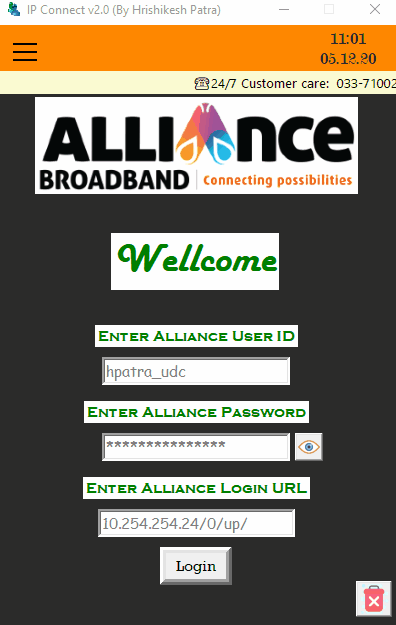

# IPConnect-V2.0
IP Connect application for Alliance Broadband Users.

Advance version of Alliance Broadband IP Connect.

Made With Python(3.9.0) And Tkinter Gui.

**For Windows Only**

**Features of IP Connect v2.0:**

1. User can save Login Credentials for hassle free Login.

2. User can show own user details (like: expiry date of package, client ID, address etc) from the application profile page.

3. User can delete Login Credentials manually.  

4. Smooth and Clean UI.

**Security:**

1. User's Login Credentials save in a encrypted file.

**Demo:**

**Requirements:**

1. cryptography

2. pypiwin32

3. requests

4. validators

5. emoji

6. bs4

7. lxml

And obviously Python 3 😆

**N.B : Test In Alliance Broadband Kolkata Circle**

**Drop a STAR if you like it!!! 😃**
